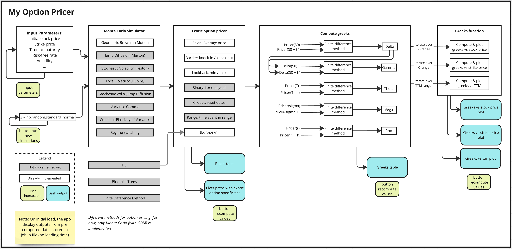

# Price My Options
This project is an Exotic Option Pricer build with Python for backend computations and Dash for interactive visualizations. It implements Monte Carlo simulations and based on a Geometric Brownian Motion model to price Asian, Lookback, Barrier (and European) options. 

## Features
- **Interactive UI**: Users can input option parameters and receive real-time computations.
- **Options Pricing**: Computes option prices using Monte Carlo simulations.
- **Greek Calculations**: Calculates Greeks (Delta, Gamma, Theta, Vega, Rho) using finite difference methods.
- **Greek Visualizations**: Plots Greeks as functions of stock price, strike price, and time to maturity.
- **Monte Carlo Simulation Paths**: Displays sample trajectories of simulated stock prices, and shows features of exotic options (ex: average line for Asian options).

## Project Goals
The ultimate objective of this project is to develop a centralized tool for comparing different stock path models and option pricing methodologies. Currently, only Monte Carlo simulations using a GBM model are implemented. Future updates will introduce:

- **Alternative stock path models**, such as stochastic volatility, jump diffusion, and regime-switching models (```detailed in documentation/models_stock_paths.md```).
- **Additional option pricing models**, including PDE-based and tree-based methods (listed in ```documentation/models_option_pricing.md```).
- **Additional exotic option types**, as detailed in ```documentation/option_types.md```.

## Considerations

Monte Carlo simulations are a computationally expensive method that requires significant processing power. While the implementation in this project is optimized using NumPy, Python's inherent limitations in handling heavy computations make it relatively slow.

To improve performance, several optimization strategies can be considered:

- **Multithreading & Multiprocessing**: Parallelizing computations to speed up simulations.
- **Rust Integration**: The most effective optimization would be rewriting the most computationally intensive parts (Monte Carlo simulations for option pricing and Greeks calculations) in Rust, then integrating it into the Python/Dash app for faster execution.

I choose to precomputed some data for a faster initial loading. To minimize the initial loading time, some simulation results are precomputed and stored in the ```precomputed_data/``` folder.

- On the first load, the app will check for this precomputed data and display it instantly.
- When the user modifies parameters or runs new simulations, the app will recompute option prices, Greeks, and plots—which will take time due to the computational complexity of Monte Carlo simulations.


## Installation

1. Clone the repository
   ```
   git clone https://github.com/QuantasticAnna/price_my_options.git
   ```

2. Navigate to the project directory
   ```
   cd price_my_options
   ```

3. Create a virtual environment
   ```
   python -m venv venv
   ```

4. Activate the virtual environment
    - On Windows:
    ```
    venv\Scripts\activate
    ```
    - On macOS/Linux:
    ```
    source venv/bin/activate
    ```
    - If error ```venv\Scripts\Activate.ps1 cannot be loaded because running scripts is disabled on this system. For more information, see about_Execution_Policies``` run and try again.
    ```
    Set-ExecutionPolicy RemoteSigned -Scope CurrentUser
    ```

5. Install the project in editable mode
    ```
    pip install -e .
    ```

## Usage

Run the following command:
```
python main.py
```

Then go to [http://127.0.0.1:8050](http://127.0.0.1:8050) on your browser.

## Project Documentation




## Folder Structure

```
price_my_options/
├── app_folder/ 
│   ├── __init__.py
│   ├── app.py                         # Main entry point for launching the Dash web app
│   ├── components_model_div.py        # UI components for the tab 'Models'
│   ├── components.py                  # Reusable UI components such as input forms, tables, graphs
│
├── documentation/
│   ├── architecture.PNG
│   ├── info_msg.py                    # Info messages that will appear when hovering on 'info' (to do)
│   ├── models_option_pricing.md       # Explanation of various option pricing models
│   ├── models_stock_price.md          # Description of stock price evolution models
│   └── option_types.md                # Overview of exotic option types
│
├── greeks/                            
│   ├── __init__.py
│   ├── delta.py
│   ├── gamma.py
│   ├── greeks_functions.py            # Function to compute greeks over stock price, strike, ttm, and plots
│   ├── greeks_map.py
│   ├── rho.py
│   ├── theta.py
│   └── vega.py
│
├── precomputed_data/                  # Precomputed Monte Carlo simulations, greeks, for quick app loading
│   ├── __init__.py
│   ├── data_precomputed.joblib
│   ├── precompute_data.py
│   ├── precomputed_greeks_vs_stock_price_results.joblib
│   ├── precomputed_greeks_vs_strike_price_results.joblib
│   └── precomputed_greeks_vs_ttm_results.joblib
│
├── pricer_plotter/                    # Pricers and plotters for each option type
│   ├── __init__.py
│   ├── asian.py
│   ├── barrier.py
│   ├── binary.py
│   ├── custom_templates.py
│   ├── cliquet.py
│   ├── european.py
│   ├── lookback.py
│   ├── monte_carlo.py
│   └── range.py
│
├── .gitignore
├── constants.py
├── README.md
├── requirements.txt
└── setup.py
```
